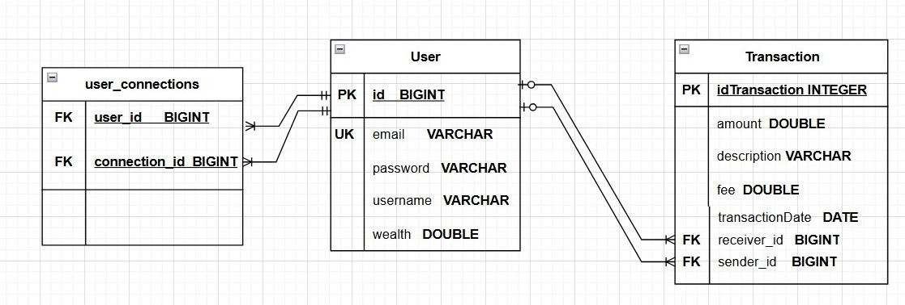

# Projet6-Concevez une application web Java de A à Z

# Etudiante : BEN OUIRANE Hajeur

- [Introduction](#introduction)
- [Contexte du Projet](#contexte-du-projet)
- [Utilisation de Draw.io](#utilisation-de-draw.io)
- [Contenu du Diagramme Physique de Données](#contenu-du-diagramme-physique-de-données)
- [Conclusion](#conclusion)

## introduction
 

Dans le cadre de notre projet 6 Concevez une application web Java de A à Z (Pay My Buddy une start-up technologique spécialisée dans les solutions bancaires et financières) de la formation Développeur d'application - Java,  il est crucial de disposer d'une représentation claire et précise de la structure physique de notre base de données. À cette fin, nous avons élaboré un diagramme physique de données (Physical Data Diagram) en utilisant l'outil Draw.io. Ce diagramme est essentiel pour comprendre comment les données sont stockées, organisées et interconnectées au niveau le plus fondamental du système.

## contexte-du-projet
 

Pay My Buddy développe une application innovante qui facilite les transactions financières entre utilisateurs, offrant des solutions de paiement sécurisées et efficaces. En tant que développeur de logiciel junior, Notre rôle consiste à contribuer à la conception et à la mise en œuvre de la base de données qui soutient cette application. Le diagramme physique de données joue un rôle central dans cette démarche, car il décrit en détail les tables, les colonnes, les types de données, les clés primaires et étrangères, ainsi que les relations entre les différentes entités de la base de données.
## utilisation-de-draw.io
Draw.io est un outil de modélisation visuelle en ligne qui permet de créer des diagrammes clairs et détaillés de manière collaborative. Nous avons choisi Draw.io pour plusieurs raisons :
<ul>
    <li> <strong>Accessibilité : </strong> Draw.io est accessible en ligne et permet une collaboration en temps réel entre les membres de l'équipe.</li>
    <li> <strong>Flexibilité :  </strong>L'outil offre une grande variété de formes et de modèles personnalisables adaptés à la modélisation de bases de données.
</li>
</ul>

## contenu-du-diagramme-physique-de-données

 

Le diagramme physique de données que nous avons créé inclut les éléments suivants :
<ul>
    <li> <strong>Tables : </strong> Représentation de toutes les tables nécessaires pour le projet, avec les colonnes correspondantes et leurs types de données.</li>
    <li> <strong>Clés Primaires et Étrangères :  </strong>Identification des clés primaires (PK) pour assurer l'unicité des enregistrements et des clés étrangères (FK) pour établir les relations entre les tables.
</li>
    <li> <strong>Contraintes : </strong> Définition des contraintes d'intégrité, telles que les contraintes de clé unique et les contraintes de validation des données.
</li>
        <li> <strong> Index : </strong> Indication des index utilisés pour améliorer les performances des requêtes.
</li>

</ul>
L'image ci-dessous montre le Diagramme Physique de Données (DPD) de notre projet chez Pay My Buddy, illustrant la structure détaillée de notre base de données, incluant les tables, les colonnes, les clés primaires et étrangères, ainsi que les relations entre les différentes entités.

   

## conclusion
 

En conclusion, le diagramme physique de données est un outil essentiel pour la conception, la mise en œuvre et l'optimisation de notre base de données. Il nous permet de visualiser et de documenter la structure physique de la base de données de manière claire et précise, facilitant ainsi la communication entre les membres de l'équipe et assurant la cohérence et l'efficacité de notre système de gestion des données.

